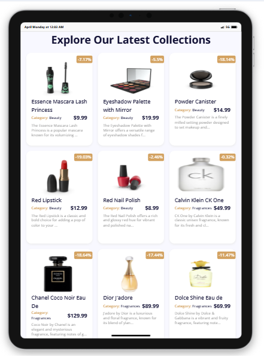

# 📦 Product List App

A simple **React** project that fetches product data from an external API and displays them neatly using reusable components.

---

## ✨ Features
- Fetch products from the [DummyJSON API](https://dummyjson.com/products).
- Display each product with:
  - DiscountPercentage
  - First product image
  - Title
  - Category
  - Price
  - Shortened description
- Component-based structure using **ProductList** and **ProductListItems** components.
- Loading state handling when fetching data.
- Error handling for failed API requests.

---

## 📸 Demo



---

## 🛠️ Built With
- **React.js** (Vite / Create React App)
- **JavaScript (ES6+)**
- **CSS**
- **DummyJSON API** for fake product data

---

## 📂 Project Structure

```
/src
 ├── components
 │    ├── ProductList.jsx
 │    └── ProductListItems.jsx
 ├── App.jsx
 └── main.jsx
README.md
package.json
...
```

---

## 🚀 Getting Started

### Prerequisites
- Node.js installed (v14 or higher recommended)
- npm or yarn

### Installation

1. Clone the repository:

```bash
git clone https://github.com/Emmanuelahdamilola/React-Product-List-App.git
cd product-list-app
```

2. Install dependencies:

```bash
npm install
# or
yarn install
```

3. Start the development server:

```bash
npm run dev
# or
yarn dev
```

4. Open your browser and visit:

```
http://localhost:5173
```

---

## 🔥 Usage

- The **ProductList** component fetches the data from the API and passes it as props to the **ProductListItems** component.
- The **ProductListItems** component loops through the array and renders product details.
- Only the **first image** of each product is displayed.
- The **description** is shortened to 100 characters.

---

## 📄 License
This project is licensed under the MIT License.

---

## 👨‍💻 Author
- **Emmanuelah Damilola**
- [GitHub Profile](https://github.com/Emmanuelahdamilola)
- [LinkedIn Profile](https://www.linkedin.com/in/damilola-emmanuelah/)
